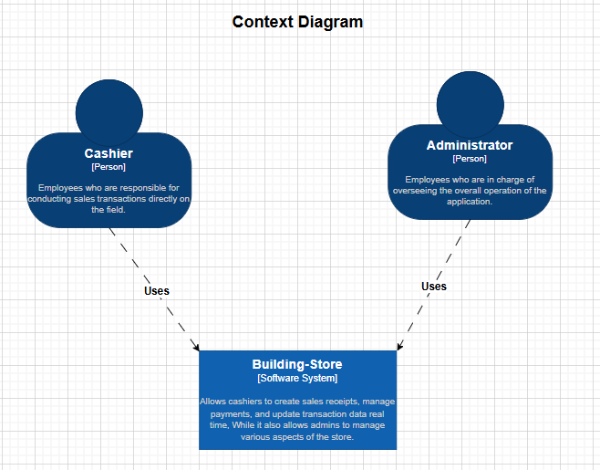
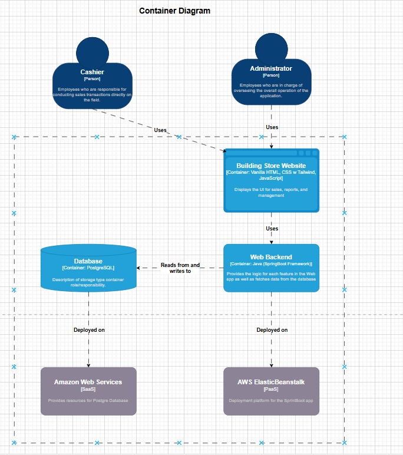
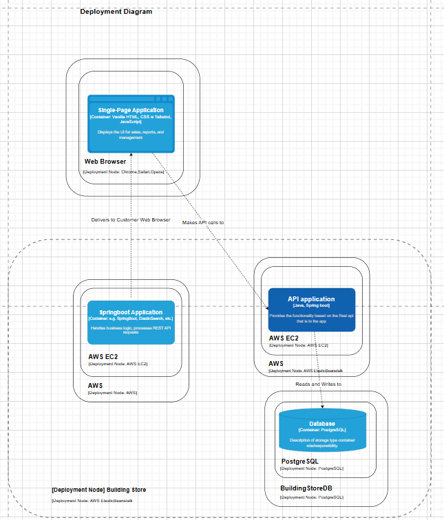
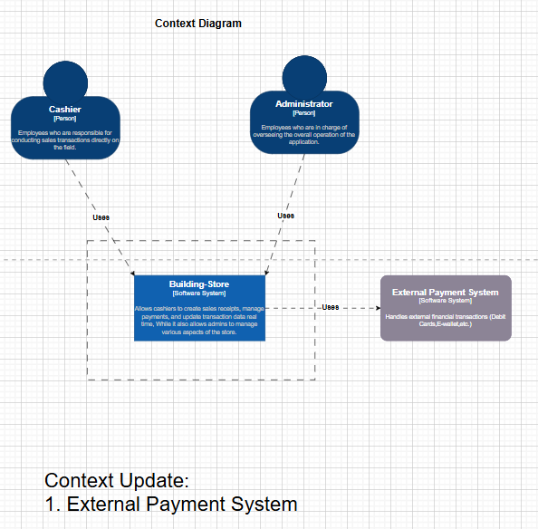
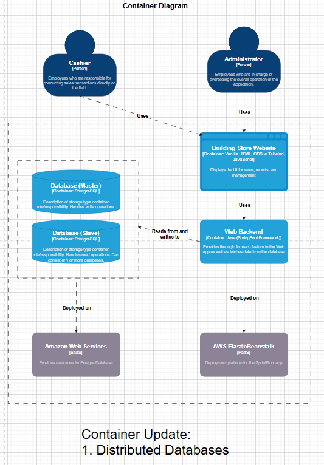
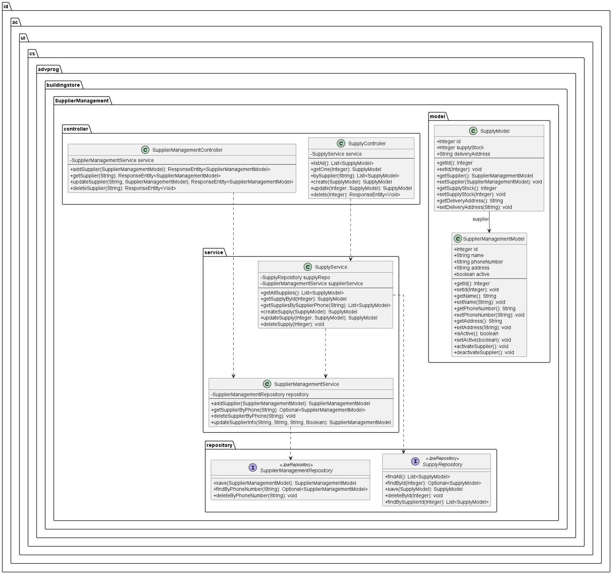
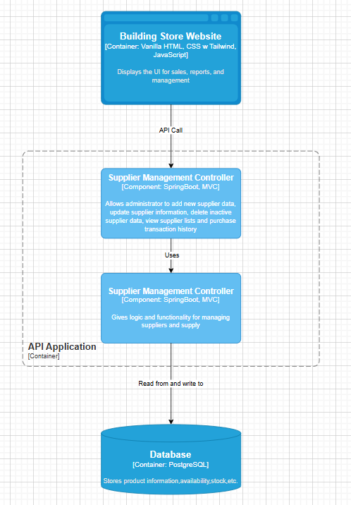
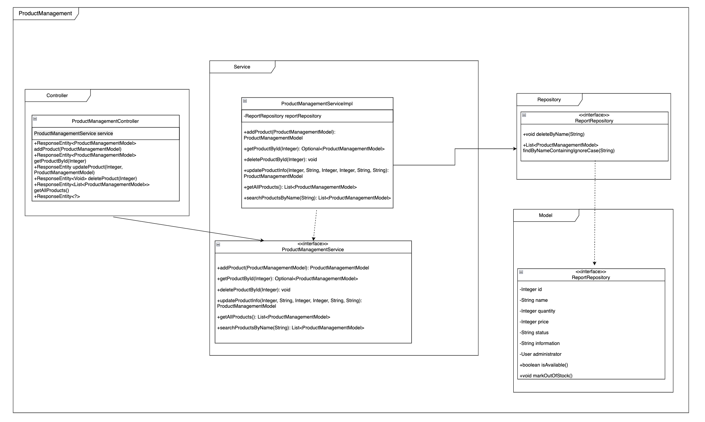
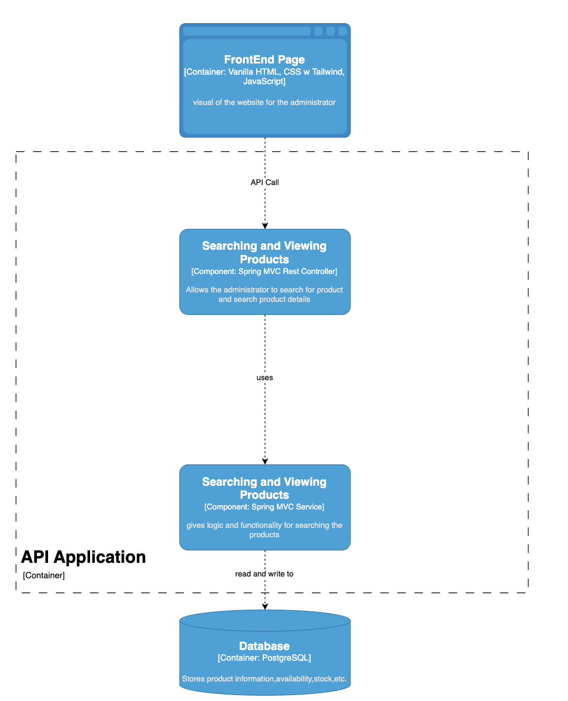

# Building Store - K4 🏪

### > Members:
- [Flori Andrea Ng - 2306171713](https://github.com//Mcflurrins)
- [Muhammad Ghaza Fadhlilbaqi - 2306173321](https://github.com/GhazaFadhlilbaqi)
- [Muhammad Jordan Ar-Razi Aziz - 2306173555](https://github.com/orgs/jordanaziz18)
- [Serafina Nala Putri Setiawan - 2306173435](https://github.com/terserahdehh)
- [Zakiy Makarim Iskandar Daulay - 2306170130](https://github.com/ZakiyDaulay)

### > [Low Level Document](https://docs.google.com/document/d/1qEDTE-nVgUmWRbDkTREXmYJrpoucAPRUFFVR-tylwIs/edit?usp=sharing)

## Group Work Allocations 🧑‍💻

**> Features**
- Authentication - Flori & Ghaza
- Sales Transaction - Flori
- Product Management - Zakiy 
- Customer Management - Jordan
- Supplier Management - Nala
- Payment Management - Ghaza 

**> Extras**
- UI-UX : Flori & Nala
- CI/CD : Ghaza
- Code Analysis: Zakiy
- AWS Database: Jordan

## Project Info 💻
**Tech Stack**
- Backend: Java + Spring Boot Framework
- Frontend: Vanilla HTML + CSS (with Tailwind) + JavaScript
- Deployment: Koyeb
- Database: Postgres (Deployed on AWS)
- Code Analysis: SonarQube Cloud

| Diagram Type         | Image                             |
|----------------------|-----------------------------------|
| *Context Diagram*    |        |
| *Container Diagram*  |    |
| *Deployment Diagram* |   |

| Diagram Type                | Image                                                   |
|-----------------------------|---------------------------------------------------------|
| *Updated Context Diagram*   |                    |
| *Updated Container Diagram* |                  |

## Discuss it and then write a well written and concise explanation why the risk storming technique is applied.  
### Risk Analysis:

### Architecture modification justification:

### 1. Distributed Database:
   After imagining how our app would look after massive success and analyzing its risks, we modified our pre-existing architecture into a distributed database architecture. This has to do with keeping up scalability and easing maintenance towards the future of our application. With only one database in our old architecture, there is a high risk that we might lose all of our data because of our single point of failure. This poses security concerns which can lead to data integrity issues as well. To mitigate this, we have decided to distribute our database, so that in the case that one of our databases are failing us, we can rely on other databases to keep our program running fine. 
   We have decided to go about this with a master-slave database architecture, where a master database handles the write operations and the slave database (or databases) handle read operations. We could've clustered the database instead by breaking the single database into separate physical databases, and while that might have reduced our risk, it would've blown a big hole in our company budget. So, after, some discussion, we came to the conclusion that our master-slave architecture (dividing the database into 2 parts) is the cheaper option which still addresses our concerns. This change is visibly sketched out in our container diagram.
   
### 2. External Payment System:
  Since we are dealing with a PoS system, we are obviously dealing with a lot of transactions. In our current architecture, we do not yet have a method of integrating our application into an external payment system. In a real-world context where our application is gaining massive success, our PoS would be interacting with all sorts of payments, such as debit, credit, OVO, Gopay, QRIS etc. Therefore our architecture has to be integrated with these external payment system(s), allowing it to track payment terminals (like debit card readers and credit card readers). This change was applied to our context diagram. 

## Individual
### Nala
| Diagram Type                       | Image                                          |
|------------------------------------|------------------------------------------------|
| *Code Diagram Supplier Management* |  |
| *Component Diagram*                |                 |
### Zakiy
| Diagram Type                           | Image                                                             |
|----------------------------------------|-------------------------------------------------------------------|
| *Code Diagram Product Management*      |  |
| *Component Diagram Product Management* |                  |

### Jordan
| Diagram Type                            | Image                                                                                                           |
|-----------------------------------------|-----------------------------------------------------------------------------------------------------------------|
| *Code Diagram Customer Management*      |   |
| *Component Diagram Customer Management* |  |

